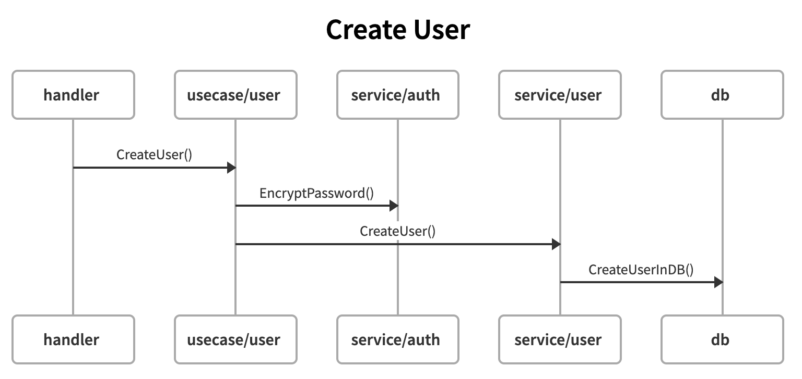

# Amartha Billing Engine

This project was developed as part of a coding assignment for Amartha. It simulates a billing engine to manage users, loans, and payments.

---

## Requirements

To run this application, ensure the following is installed:

1. **Docker**: [Install Docker](https://docs.docker.com/get-docker/)

---

## How to Run the Application

Follow these steps to set up and run the application:

1. Start Docker.
2. Run the following command to install dependencies:
   ```bash
   make dep
   ```
3. Start the application:
   ```bash
   make run
   ```
4. The application will be running when you see the message:
   ```
   HTTP running at :8080
   ```

---

## Setting Up Tests

To test the application, follow these steps:

1. Execute all SQL queries in `etc/files/queries.sql` **in the specified order**.
2. Create a user using the `CreateUser` endpoint.
3. Create a loan for the newly created user using the appropriate endpoint.

---

## Class Diagram


---

## Limitations

As this is a mock project, some features are not included due to time constraints:

1. The code is mockable, but unit tests (UT) and comprehensive documentation are not provided.
2. No Role-Based Access Control (RBAC).
3. No authorization mechanisms.

---

## API Documentation

## Postman Collection: https://drive.google.com/file/d/1FebBsbBOKhso0ZmfMTKh8W8YldHHFUXb/view?usp=drive_link

### POST: Create User

This endpoint is used to create a new user.

**Request**:

- **name**: `string` (required)
- **password**: `string` (required)

**Response**:

- **code**: `int`
- **message**: `string`
- **error**: `string`
- **response**: `object`

**Flow**:


### POST: Create Loan

This endpoint is used to create a loan for a user.

**Request**:

- **user_id**: `int64` (required)
- **amount**: `float64` (required)
- **interest_rate**: `float64` (required)
- **duration_in_weeks**: `int` (optional, defaults to 50 if not provided)

**Response**:

- **code**: `int`
- **message**: `string`
- **error**: `string`
- **response**: `object`

**Flow**:


### POST: Pay Weekly Installment

This endpoint is used to pay a weekly installment. It pays the oldest unpaid entry in the database.

**Request**:

- **loan_id**: `int64` (required)

**Response**:

- **code**: `int`
- **message**: `string`
- **error**: `string`
- **response**: `object`

**Flow**:


### GET: Get Outstanding Balance

This endpoint is used to get the outstanding balance of a loan.

**Path**: `{{host}}/loans/{loan_id}/outstanding-balance`

**Response**:

- **code**: `int`
- **message**: `string`
- **error**: `string`
- **response**: `object`

**Flow**:


### GET: Get Delinquent Users

This endpoint is used to retrieve all delinquent users.

**Path**: `{{host}}/users/delinquent?date=01-01-2026`

**Query Parameter**:

- **date**: (optional) If provided, retrieves users with more than two unpaid payments due before the specified date. If omitted, defaults to the current date. This parameter is useful for testing purposes.

**Response**:

- **code**: `int`
- **message**: `string`
- **error**: `string`
- **response**: `object`

**Flow**:

